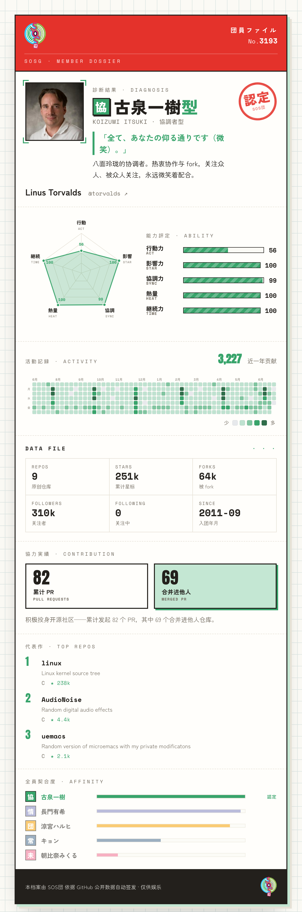

# sosg-gitcard

> 把任何人 GitHub 主页的域名换成 **harufan**，就能看到 TA 的「SOS団 团员档案」——一张《凉宫春日》风格的 GitHub 数据卡。

**在线体验 👉 [harufan.com/torvalds](https://harufan.com/torvalds)** （把 `torvalds` 换成任意 GitHub 用户名）



## 它做什么

输入一个 GitHub 用户名，它会：

- **认定团员** —— 按公开数据把 TA 判成最像的一位 SOS団 成员：团长（凉宫春日）、情报统合（长门有希）、未来人（朝比奈实玖瑠）、协调者（古泉一树）、常识人（阿虚）。
- **签发档案卡** —— 五维能力雷达、关键数据、近一年贡献热力图、代表作、与全员的契合度。
- **一键存成长图**，方便分享。

## 几个有意思的地方

- **不只看星星。** 很多人自己项目不多，却是开源社区里默默干活的人。所以这里会统计你合并进他人仓库的 PR，让默默投入开源的贡献也被看见。
- **纯前端，零服务器压力。** GitHub 数据全在你自己浏览器里直连拉取，服务器只负责发静态文件。（贡献热力图 GitHub 不允许跨域读取，用一个边缘函数代理了下。）
- **结果可复现。** 同一个人的诊断永远一致，不是抽卡；算法都在 `src/members.ts`，一看便知。

## 本地运行

```bash
npm install
npm run dev        # 然后打开 http://localhost:5173/torvalds
```

## 部署

托管在 **Cloudflare Pages**：一个静态站，外加一个同源代理函数（`functions/api/contributions.ts`）负责取贡献热力图。

```bash
npm run deploy     # 构建并发布，需设置 CLOUDFLARE_API_TOKEN 和 CLOUDFLARE_ACCOUNT_ID
```

## 技术栈

Vite · 原生 TypeScript · 纯 SVG 图表 · Cloudflare Pages。无前端框架、无 UI 库、无图表库。

## 免责

粉丝二次创作，仅供娱乐，团员判定与本人实际无关。《凉宫春日》角色版权归谷川流 / 角川所有。

<sub>世界を大いに盛り上げるための涼宮ハルヒの団</sub>
